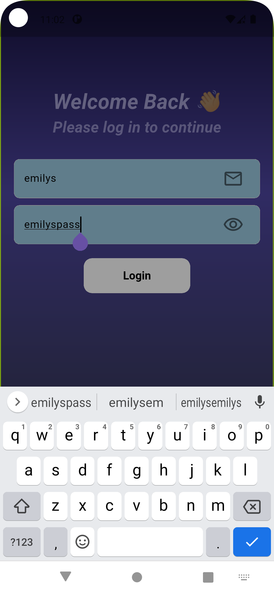
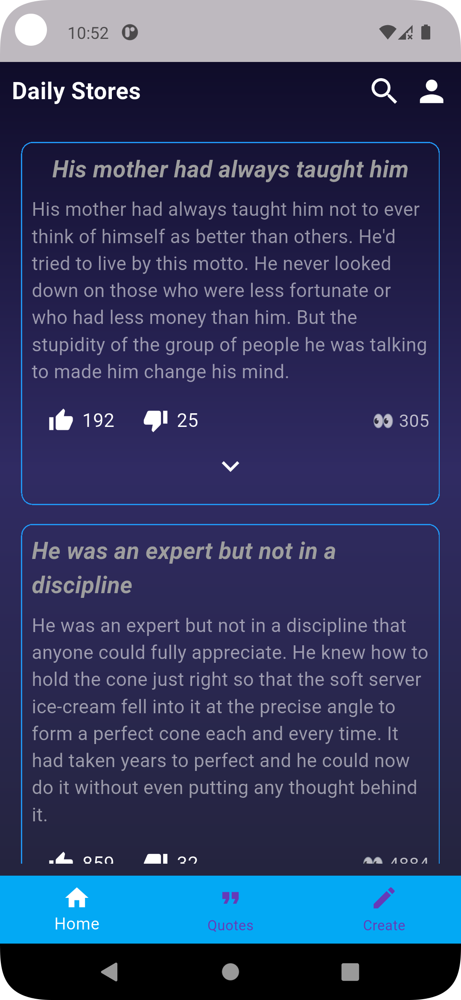
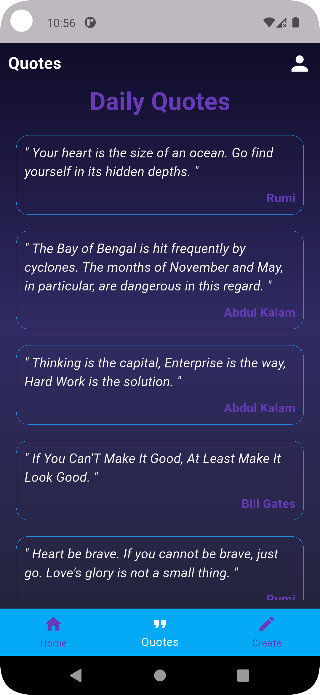
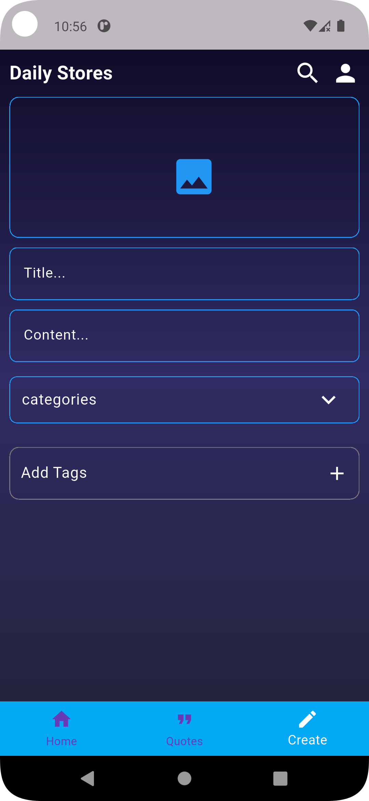
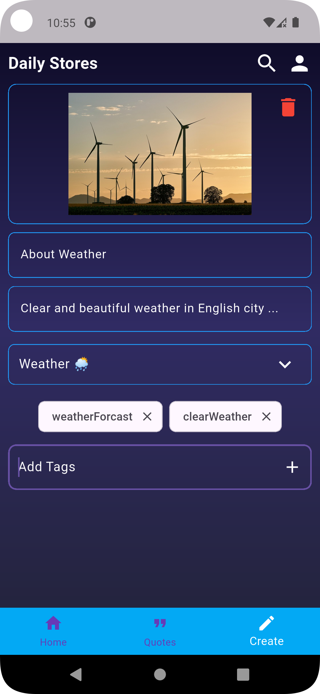
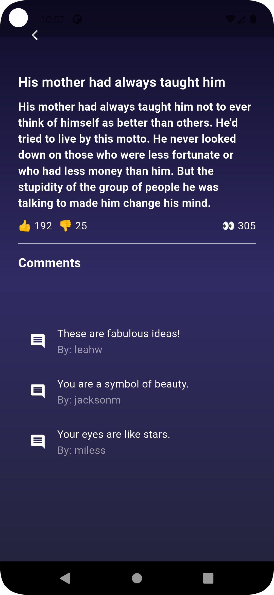
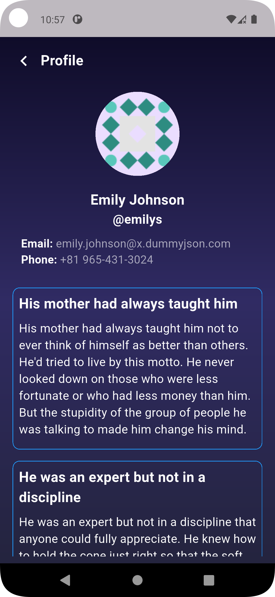

<h1 align="center">📰 Blog & Quotes App</h1>

<p align="center">
  📱 <strong>A Flutter + REST API Blog & Quotes App</strong>.
</p>

---

### 📋 Project Description

**Blog & Quotes App** is a **Flutter-based mobile application** that connects with a REST API to fetch and display **blogs, posts, comments, and quotes** in real time.  
It provides a smooth user experience with **authentication, CRUD operations, and dynamic content fetching**.

Perfect for developers and learners who want to practice **Flutter with REST APIs** and implement **state management with Provider**.

It helps you to:

- 🔐 **Authenticate Users**
- 📝 **Create, Read, Update, and Delete Posts**
- 💬 **View & Add Comments**
- 📖 **Explore Quotes & Random Quotes**
- ⚡ **Learn REST API Integration in Flutter**

---

### 🧰 Features

- ✅ Splash Screen with Auth Check (token-based login)
- ✅ Login Screen with API authentication
- ✅ Home Screen with Bottom Navigation
- ✅ Posts Tab:
    - List all posts from API
    - View Post Details
    - Show Comments
    - CRUD support for Posts
- ✅ Quotes Tab:
    - List all quotes
    - Show random quotes
- ✅ Provider State Management
- ✅ Error & Loading Handling
- ✅ Clean and Minimal UI

---

### 🔧 Tech Stack

- **Flutter** – Cross-platform framework
- **Dart** – Language powering Flutter
- **Provider** – State management
- **REST API** – For blogs, comments, and quotes
- **HTTP Package** – API requests

---

### 📱 Screenshots

| Login Screen                                               |
|------------------------------------------------------------|
|  |

| Home Screen                                               |
|-----------------------------------------------------------|
|  |

| Quotes Screen                                              |
|------------------------------------------------------------|
|  |

| Post Creation Screen                                        |
|-------------------------------------------------------------|
|  |

| Post Created Screen                                        |
|------------------------------------------------------------|
|  |

| Post Open Screen                                              |
|---------------------------------------------------------------|
|  |

| User Profile Screen                                              |
|------------------------------------------------------------------|
|  |

---

### 🏁 Getting Started

To get started with this project, follow these steps:

1. Clone the repository:
    ```bash
    git clone https://github.com/IAftabRehman/Flutter-API-Blog-Quotes.git
    ```

2. Navigate to the project directory:
    ```bash
    cd FLutter-API-Blog-Quotes
    ```

3. Install dependencies:
    ```bash
    flutter pub get
    ```

4. Run the app:
    ```bash
    flutter run
    ```

---

### 📦 API Endpoints

- **Auth:** `/auth/login`
- **Posts:** `/posts`
- **Comments:** `/posts/{id}/comments`
- **Quotes:** `/quotes`
- **Random Quote:** `/quotes/random`

---

### 💬 Ask Me Anything!

Got suggestions or feedback? Feel free to contact:

📧 **Email:** iamaftabrehman@gmail.com  
🧑‍💻 **GitHub:** [IAftabRehman](https://github.com/IAftabRehman)  
💼 **LinkedIn:** [Aftab Rehman](https://www.linkedin.com/in/aftab-rehman)

---

### 📊 GitHub Stats

<div align="center">
  
  
</div>

---

<p align="center">
  🌟 Star this repo if it helped you!
  <br/>
  Made with ❤️ by <a href="https://github.com/IAftabRehman">IAftabRehman</a>
</p>
